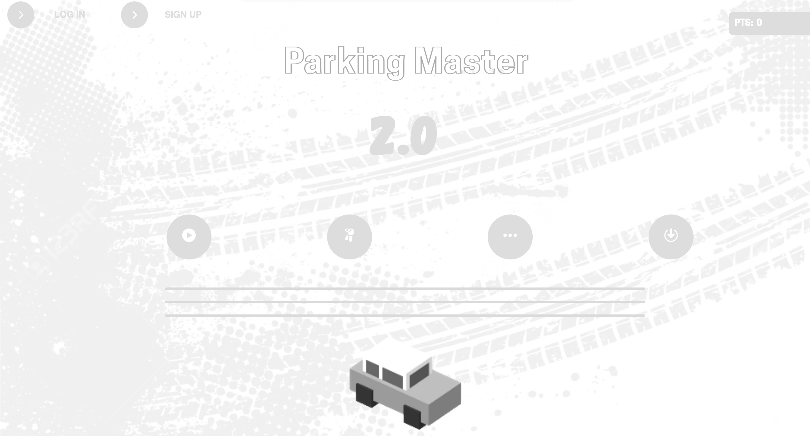

### Development Progress Tracker _(DPT)_
>84%  
Game developement day 84 of 100 (<b>84_/_100</b>) 16% Developement work left
# &nbsp;&nbsp;Parking-Master-2.0
Welcome to the all-new Parking-Master-2.0!

Parking-Master-2.0 is the all new Parking Master!
 
Fully upgraded UI, Security & In-Game Experience!
 
## History
Parking-Master 1.0 (v1.0.0) is the first and official version of Parking Master, released on the first of August in 2021.
 
As such, Parking Master will have a celebration for the 1 year anniversary and popularity - Parking Master 2.0, The all-new Parking Master game.
 
The original Parking-Master's popularity has grown since it was released.

 

View history

 
 
v1.9

 
v1.6

 
< v1.0 (in production)

 

The latest version since then is 1.9, the latest and last version of Parking Master.
 
Version 1.9 will still have some minor updates, but not big ones.
 
Version 2.0 is the all-new "remodeled" game, which inludes Bug fixes, Updated GUI/UI, Security updates, and New Levels.
 
 
[\> \><u> www.parkingmaster.tk </u>\< \<](https://www.parkingmaster.tk)
 
 
You can play the original game at <kbd>https://parkingmaster.w3spaces.com</kbd>
 
 
 
 
 
 
<h2 align="left">Desktop App (Out now!)</h2>
Version 2.0 has a lightweight desktop app for Windows, Mac & Linux.
 

 
Play multiplayer, offline-cached edition, login/signup, the possibilities are endless!
 
 
- <a href="https://parkingmaster.tk/Parking Master 2.0 (Mac v1).zip" rel="nofollow">Download for MacOS</a> 
- <a href="https://parkingmaster.tk/Parking Master 2.0 (Win v1).zip" rel="nofollow">Download for Windows</a> 
- <a href="https://parkingmaster.tk/Parking Master 2.0 (Lin v1).zip" rel="nofollow">Download for Linux</a> 
 
<h2>Play on the go</h2>
Parking Master 2.0 will have a MiniGame built into a desktop browser extension.
 
This is a backup in case you can't download the app.
<h2>Multiplayer</h2>
With internet connection, all players are welcomed to play multiplayer in the website, app and minigame.
 
Multiplayer Parking Master 2.0 will have level-based challenges, but with multiplayer.
 
Players will be able to create a lobby name, go to the public "Lobby" page, and view/create a multiplayer server.
 
 
Try it out:
 
Enter a lobby name (2-10 characters): 

<h2>Credits</h2>
A list of items that helped make Parking-Master-2.0 possible.

##### SweetAlert \> https://sweetalert.js.org
##### TippyJS \> https://atomiks.github.io/tippyjs
##### SecurityJS.128 \> https://parking-master.github.io/SecurityJS.128
##### Parking-Master \> https://parkingmaster.w3spaces.com
##### Canva \> https://www.canva.com
##### Gametime.js \> https://gametime.js.org
##### Back4App \> https://www.back4app.com
##### Parse API \> https://parse-dashboard.back4app.com
##### Node.js \> https://www.nodejs.org/en
##### Google reCaptcha \> https://developers.google.com/recaptcha
##### W3Schools Spaces \> https://spaces.w3schools.com
##### ElectronJS \> https://electronjs.org
___
## Support & Contribution
Anyone can support this project by opening an issue for bug details, feedback, and even your own opinion!

Leave an idea in the "Issues" section and it may be available on Parking Master 2.0 one day!

Send us an email for a any other purposes: __parkingmaster@email.com__

## License
Parking Master and this project are licensed under the [MIT license](./blob/main/LICENSE).